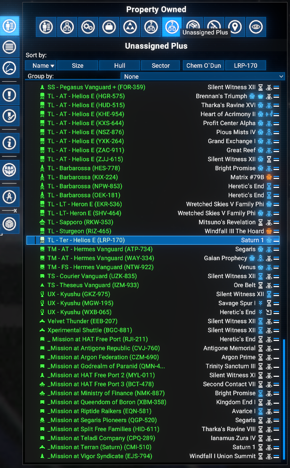
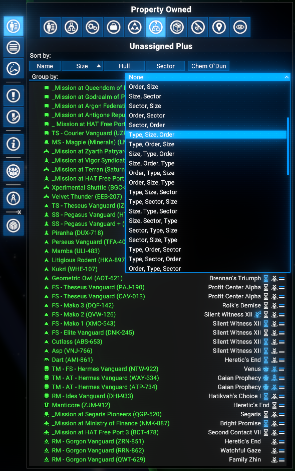
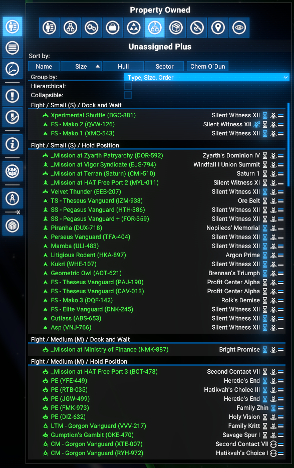
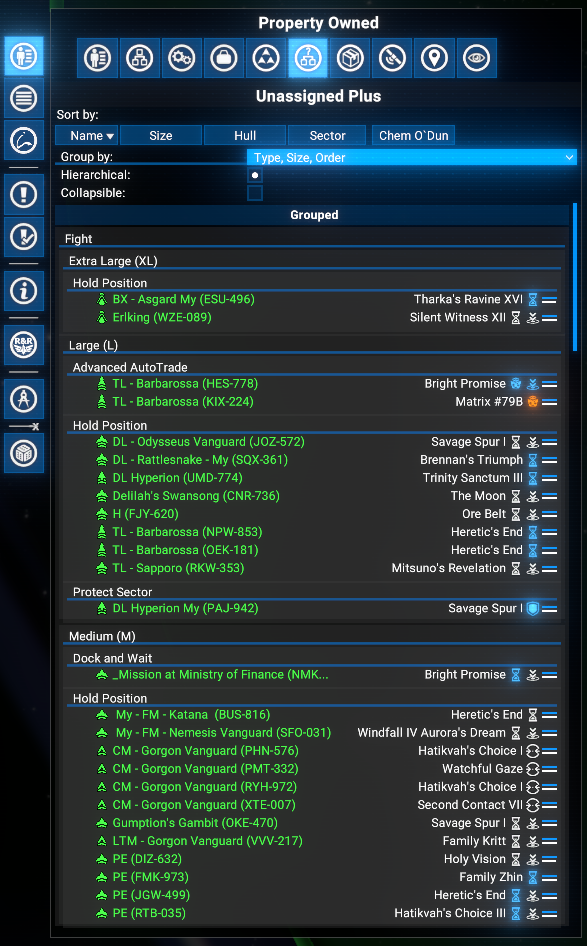
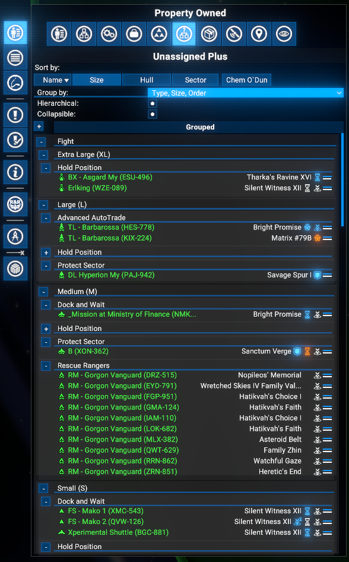
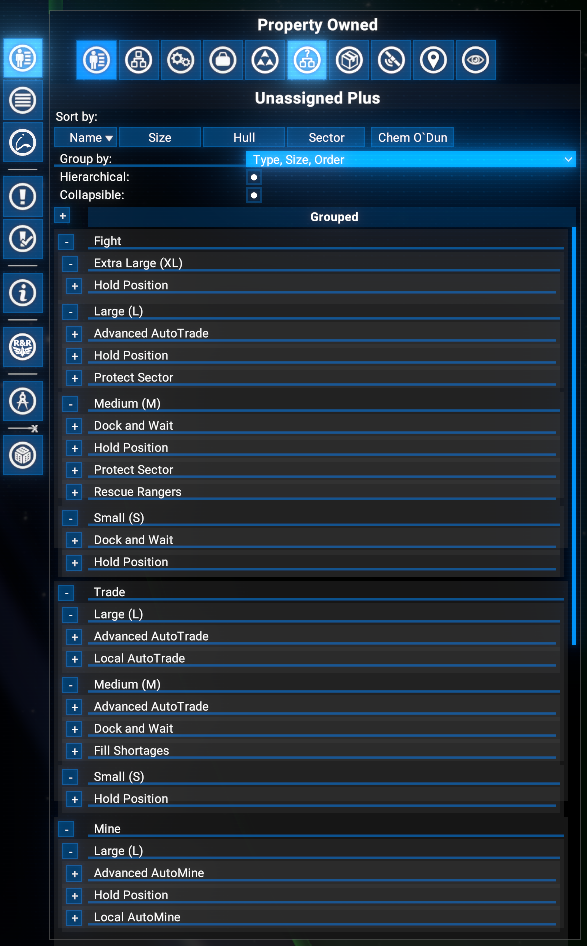
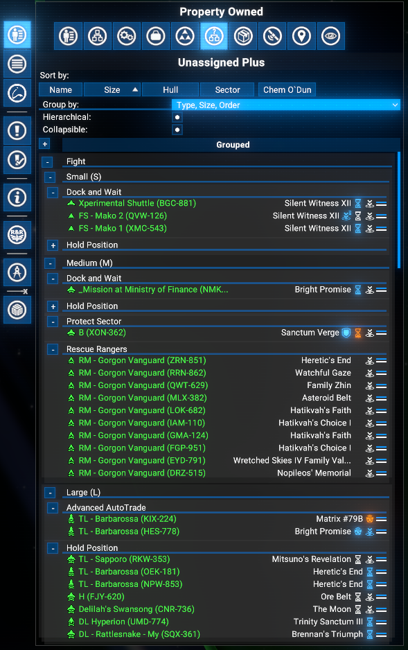
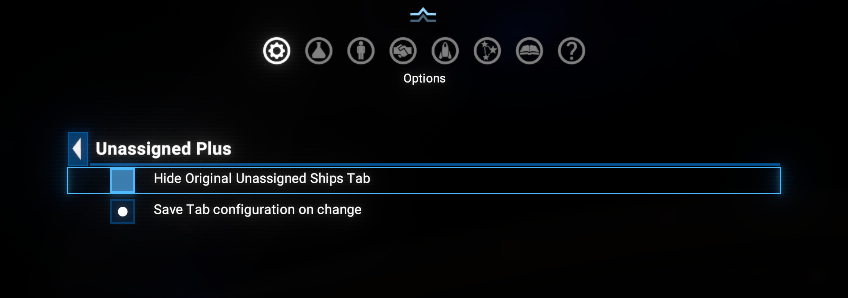

# Unassigned Plus

Adds an **Unassigned Plus** tab to the **Property Owned** menu in the map, placed next to the vanilla Unassigned Ships tab. A dropdown at the top of the tab lets you auto-group unassigned ships into folders by Type, Size, Order, Sector, or any combination of all four - with optional collapsible groups and hierarchical nesting.

## Features

- **Unassigned Plus tab**: A dedicated tab in the Property Owned menu lists all unassigned ships with the same ship rows as the vanilla view - hull bars, action buttons, and sub-expansion all work exactly as in the vanilla tab.
- **Flexible grouping**: Ships can be grouped by any single dimension or any combination of up to four dimensions: **Type** (Purpose), **Size**, **Order**, **Sector**. All permutations are available in the dropdown.
- **Hierarchical groups**: When multiple grouping dimensions are selected, enable the **Hierarchical** checkbox to render groups as a nested tree of headers rather than flat concatenated labels.
- **Collapsible groups**: Enable the **Collapsible** checkbox to add +/- toggle buttons to group headers. A master expand/collapse button appears in the section header row. Collapsed state is preserved when re-opening the tab.
- **Group ordering**: Purpose groups follow a logical role order (Fight, Auxiliary, Trade, Mine, Salvage, Build, Other); Size groups are sorted largest-first; Order and Sector groups are sorted alphabetically.
- **Save configuration**: When the **Save Tab configuration on change** option is enabled (default: on), the current grouping mode, hierarchical, and collapsible settings are persisted to the save file and restored on the next session.
- **Hide vanilla tab**: Optionally hide the original Unassigned Ships tab to reduce clutter.
- **Tab positioning**: The tab is placed immediately after the vanilla Unassigned Ships tab.
- **Compatible with X4 8.00 and 9.00**.

## Requirements

- **X4: Foundations**: Version **8.00HF4** or higher and **UI Extensions and HUD**: Version **v8.0.4.x** or higher by [kuertee](https://next.nexusmods.com/profile/kuertee?gameId=2659):
  - Available on Nexus Mods: [UI Extensions and HUD](https://www.nexusmods.com/x4foundations/mods/552)
- **X4: Foundations**: Version **9.00 beta 3** or higher and **UI Extensions and HUD**: Version **v9.0.0.0.3** or higher by [kuertee](https://next.nexusmods.com/profile/kuertee?gameId=2659).
- **Mod Support APIs**: Version 1.95 or higher by [SirNukes](https://next.nexusmods.com/profile/sirnukes?gameId=2659):
  - Available on Steam: [SirNukes Mod Support APIs](https://steamcommunity.com/sharedfiles/filedetails/?id=2042901274)
  - Available on Nexus Mods: [Mod Support APIs](https://www.nexusmods.com/x4foundations/mods/503).
- **Options Helper**: Version 1.0 or higher by [Chem O`Dun](https://next.nexusmods.com/profile/ChemODun/mods?gameId=2659):
  - Available on Steam: [Options Helper](https://steamcommunity.com/sharedfiles/filedetails/?id=3715253556)
  - Available on Nexus Mods: [Options Helper](https://www.nexusmods.com/x4foundations/mods/2089)

## Installation

- **Steam Workshop**: [Unassigned Plus](https://steamcommunity.com/sharedfiles/filedetails/?id=3715487702)
- **Nexus Mods**: [Unassigned Plus](https://www.nexusmods.com/x4foundations/mods/2090)

## Usage

Open the map, switch to the **Property Owned** panel, and click the **Unassigned Plus** tab in the tab strip.

### Grouping dropdown

The first row of the tab contains a **Group by:** dropdown.

Available options:

- **None** - no grouping; ships listed flat, same as vanilla.
- **Type** - group by ship role: Fight, Trade, Mine, Salvage, Build, Auxiliary, Other.
- **Size** - group by hull class: XL, L, M, S, XS.
- **Order** - group by the ship's current order name.
- **Sector** - group by the ship's current sector.
- **Type, Size** / **Size, Type** / ... - multi-dimension grouping; all permutations of up to all four dimensions are available.

### Hierarchical checkbox

Visible when any grouping is active. When checked, multi-dimension groups are rendered as a nested tree: the first dimension forms top-level group headers, each of which contains sub-headers for the second dimension, and so on. When unchecked, the combined label (e.g. "Fight / Small") is used as a single flat header.

### Collapsible checkbox

Visible when any grouping is active. When checked, each group header gains a **+/-** toggle button. The section header row also gains a master button to expand or collapse all groups at once. Groups start expanded; collapsed state is remembered until the grouping mode changes.

#### Collapse all button

When collapsible groups are enabled, a master toggle button appears in the section header row. Clicking it collapses or expands all groups at once.

### Sorting

The sorting buttons take effect immediately when on grouped objects, mostly inside a groups.
But in addition the sorting by size and sector has also effect on groups itself.

### Extension options

**Options Menu > Extension options > Unassigned Plus**:

- **Hide Original Unassigned Ships Tab**: When enabled, the vanilla Unassigned Ships tab is removed from the tab strip. Disabled automatically if the vanilla tab was already hidden by another mod.
- **Save Tab configuration on change**: When enabled (default), the current grouping mode, Hierarchical, and Collapsible settings are saved to the game save whenever they change and restored automatically on the next session.

## Credits

- **Author**: Chem O`Dun, on [Nexus Mods](https://next.nexusmods.com/profile/ChemODun/mods?gameId=2659) and [Steam Workshop](https://steamcommunity.com/id/chemodun/myworkshopfiles/?appid=392160)
- *"X4: Foundations"* is a trademark of [Egosoft](https://www.egosoft.com).

## Acknowledgements

- [EGOSOFT](https://www.egosoft.com) - for the X series.
- [kuertee](https://next.nexusmods.com/profile/kuertee?gameId=2659) - for the `UI Extensions and HUD` that makes this extension possible.
- [SirNukes](https://next.nexusmods.com/profile/sirnukes?gameId=2659) - for the `Mod Support APIs` that power the UI hooks and options menu.

## Changelog

### [8.00.01] - 2026-04-27

- **Added**
  - Initial public version.
